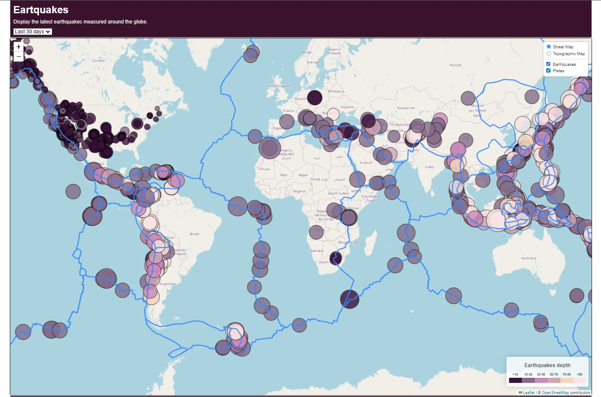

# leaflet-challenge
Repository for Monash University Bootcamp Module 15

## File structure
- `index.html` is the HTML page of the dashboard (open it to see the dashboard)
- `static/css/style.css` contains the CSS stylesheet for the dashboard
- `static/js/logic.js` contains all the JavaScript code for the dashboard
- `Leaflet-Part-2` contains the GeoJSON data used to display the tectonic plates

## Use the dashboard
Open `index.html` in any browser (tested only in Google Chrome.) Alternatively, access it on [the project's GitHub Page](https://benoitchamot.github.io/leaflet-challenge/).

The dashboard is shown below:

Use the dropdown menu to select data from the past 7 or 30 days.
 Use the map control to toggle between map layers and display the earthquakes and/or tectonic plates boundaries.
 Click on the markers to get the earthquake's location, magnitude and depth.

## Data sources
- Earthquakes information: https://earthquake.usgs.gov/earthquakes/feed/v1.0/geojson.php
- Tectonic plates boundaries: https://github.com/fraxen/tectonicplates/tree/master/GeoJSON
